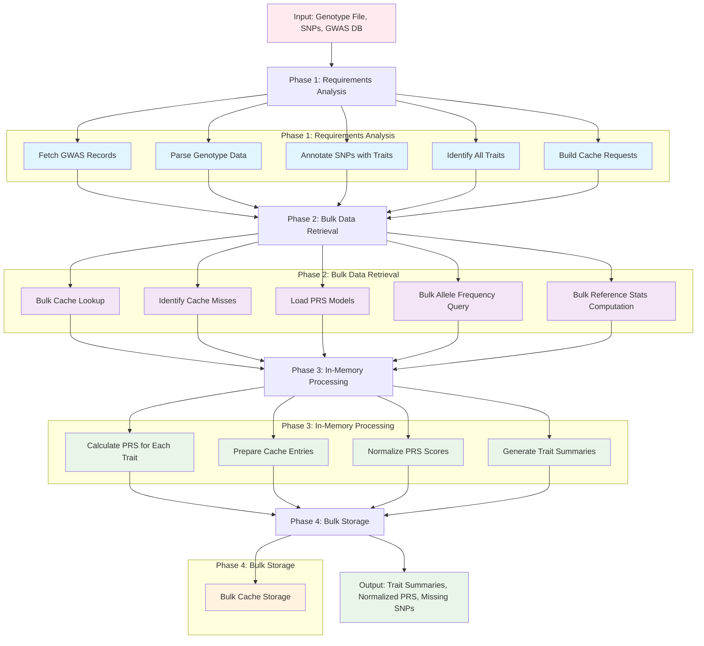
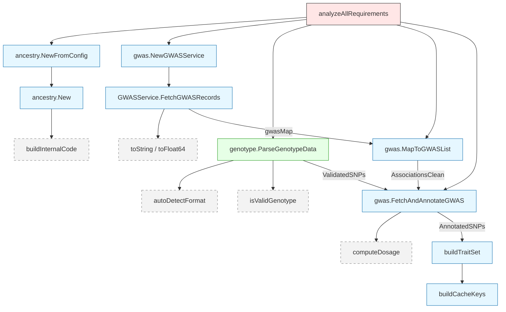
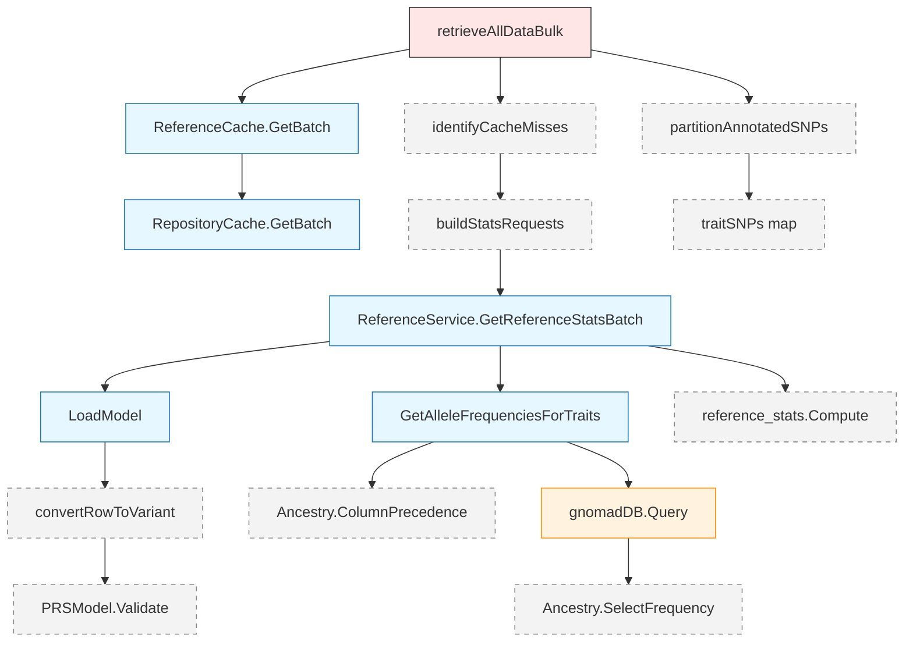
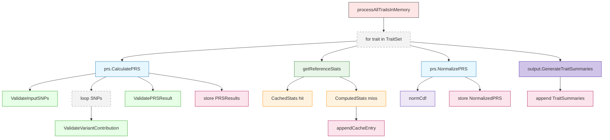
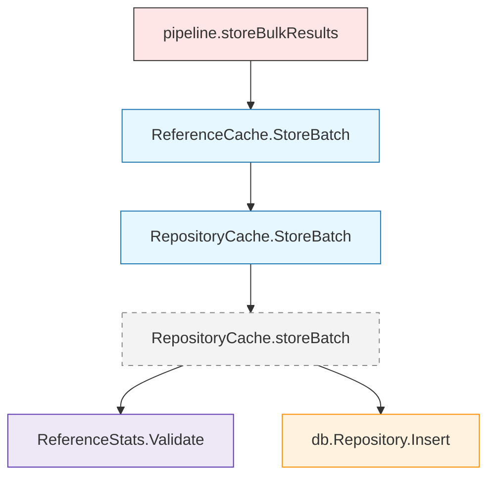

# Polygenic Risk Calculator Pipeline - Technical Report

## Overview

The polygenic risk calculator pipeline is designed to compute polygenic risk scores (PRS) from user genotype data and GWAS summary statistics using a 4-phase bulk optimization approach. The pipeline prioritizes cost efficiency and performance by minimizing external database operations through intelligent batching and caching strategies.

## Intended Workflow for Bulk Pipeline Operations

The pipeline follows a 4-phase approach optimized for bulk operations:

1. **Phase 1: Requirements Analysis** - Pre-analyze all data needs across all traits
2. **Phase 2: Bulk Data Retrieval** - Execute minimal BigQuery operations to fetch all required data
3. **Phase 3: In-Memory Processing** - Process all traits using pre-loaded bulk data
4. **Phase 4: Bulk Storage** - Store all computed results in single bulk operations

This design minimizes external API calls and database operations by batching all requirements upfront, then processing everything in memory before performing bulk storage operations.

### Workflow Diagram

## Phase 1: Requirements Analysis

Order of operations:
1. Fetch GWAS Records
2. Parse Genotype Data
3. Annotate SNPs with Traits
4. Identify All Traits
5. Build Cache Requests

### Phase 1 Call Graph

### Fetch GWAS Records
- Purpose: Pre-load effect sizes, risk alleles, and trait tags for the requested rsids so later stages avoid per-SNP DB calls.
- Key function(s): `gwas.NewGWASService` → `GWASService.FetchGWASRecords` (DuckDB query).
- Inputs: slice of rsids, `gwas_db_path`, `gwas_table` from config.
- Outputs: `map[string]model.GWASSNPRecord` used downstream and converted to a slice via `MapToGWASList`.

### Parse Genotype Data
- Purpose: Read the user genotype file (AncestryDNA or 23andMe), keep rows matching the requested rsids, validate nucleotides, and flag missing ones.
- Key function(s): `genotype.ParseGenotypeData` (auto-detect format, validate, build output struct).
- Inputs: `GenotypeFilePath`, slice of rsids, GWAS record map (for cross-validation).
- Outputs: `ParseGenotypeDataOutput` containing `UserGenotypes`, `ValidatedSNPs`, and `SNPsMissing`.

### Annotate SNPs with Traits
- Purpose: Merge validated user SNPs with GWAS effect data, compute allele dosage, and attach trait identifiers for per-trait grouping.
- Key function(s): `gwas.FetchAndAnnotateGWAS` which calls `computeDosage`.
- Inputs: `ValidatedSNPs`, GWAS associations slice.
- Outputs: `AnnotatedSNPs` slice and the subset of `GWASRecords` actually used.

### Identify All Traits
- Purpose: Collect the unique set of traits present in `AnnotatedSNPs`; this drives all later per-trait loops.
- Implementation: inline set-building loop in `pipeline.analyzeAllRequirements`.
- Inputs: `AnnotatedSNPs`.
- Outputs: `map[string]struct{}` representing the trait universe for this run.

### Build Cache Requests
- Purpose: Convert the trait set into cache keys (`<ancestry>|<trait>|<model>`) so reference statistics can be fetched in one batch during Phase 2.
- Implementation: inline in `pipeline.analyzeAllRequirements` using ancestry code from config.
- Inputs: trait set, ancestry code.
- Outputs: `[]reference_cache.StatsRequest` later passed to the bulk cache lookup.

## Phase 2: Bulk Data Retrieval

### Phase 2 Call Graph

Order of operations:
1. Bulk Cache Lookup
2. Identify Cache Misses
3. Load PRS Models
4. Bulk Allele Frequency Query
5. Bulk Reference Stats Computation

### Bulk Cache Lookup
- Purpose: Retrieve previously computed reference statistics for all traits in a single round-trip to the cache backend (BigQuery or DuckDB, depending on deployment).
- Key function(s): `ReferenceCache.GetBatch` invoked by `pipeline.retrieveAllDataBulk`.
- Inputs: `[]reference_cache.StatsRequest` – ancestry code, trait, model id.
- Outputs: `map[string]*reference_stats.ReferenceStats` stored in `bulkData.CachedStats`.

### Identify Cache Misses
- Purpose: Determine which traits still need reference stats after the cache lookup.
- Implementation: loop over `TraitSet`; if cache key absent, append to `cacheMisses` slice.
- Inputs: cache results from previous step, set of trait keys.
- Outputs: `[]string` of traits requiring fresh computation.

### Load PRS Models
- Purpose: For every cache-miss trait, load all SNP effect sizes in one DuckDB query per trait.
- Key function(s): `ReferenceService.LoadModel` (internally called inside `GetReferenceStatsBatch`).
- Inputs: trait name, model table (`reference.model_table` config).
- Outputs: `PRSModel` objects containing `[]model.Variant` used later for stats.

### Bulk Allele Frequency Query
- Purpose: Fetch allele frequencies for all unique variants across all cache-miss traits using a single BigQuery query, minimizing cost.
- Key function(s): `ReferenceService.GetAlleleFrequenciesForTraits`.
- Inputs: map `trait → []Variant`, ancestry object (for column precedence).
- Outputs: map `trait → variantID → frequency` consolidated in memory.

### Bulk Reference Stats Computation
- Purpose: Combine allele frequencies with model effect sizes to compute mean, std, min, and max PRS distribution parameters for each trait.
- Key function(s): `reference_stats.Compute` executed inside `ReferenceService.GetReferenceStatsBatch`.
- Inputs: allele frequency map, per-trait `PRSModel` effect sizes.
- Outputs: `map[string]*reference_stats.ReferenceStats` returned as `bulkData.ComputedStats` for downstream normalization.

## Phase 3: In-Memory Processing

### Phase 3 Call Graph

Order of operations:
1. Calculate PRS for Each Trait
2. Prepare Cache Entries
3. Normalize PRS Scores
4. Generate Trait Summaries

### Calculate PRS for Each Trait
- Purpose: Aggregate per-trait SNP contributions to produce an unnormalized polygenic risk score.
- Key function(s): `prs.CalculatePRS` (iterates over `[]model.AnnotatedSNP`, multiplies dosage by beta, returns `PRSResult`).
- Inputs: slice of annotated SNPs for a single trait.
- Outputs: `PRSResult` with total score and per-SNP contribution breakdown.

### Prepare Cache Entries
- Purpose: For traits whose reference stats were newly computed (cache miss), stage them for bulk cache write in Phase 4.
- Implementation: When stats come from `bulkData.ComputedStats`, build `reference_cache.CacheEntry` and append to `cacheEntries`.
- Inputs: `ComputedStats` map, ancestry code.
- Outputs: `[]reference_cache.CacheEntry` carried forward to bulk storage.

### Normalize PRS Scores
- Purpose: Convert raw PRS into an interpretable percentile using ancestry-/trait-specific reference parameters.
- Key function(s): `prs.NormalizePRS`, which wraps `reference_stats.NormalizePRS` logic.
- Inputs: `PRSResult` from previous step, `model.ReferenceStats` fetched/computed in Phase 2.
- Outputs: `prs.NormalizedPRS` (raw score, z-score, percentile) stored in `NormalizedPRS` map.

### Generate Trait Summaries
- Purpose: Produce a human-readable summary per trait (risk level, allele counts, effect-weighted contribution).
- Key function(s): `output.GenerateTraitSummaries`.
- Inputs: trait's annotated SNPs, its normalized PRS percentile.
- Outputs: `[]output.TraitSummary` appended to `TraitSummaries` slice.

## Phase 4: Bulk Storage

Order of operations:
1. Bulk Cache Storage

### Phase 4 Call Graph

### Bulk Cache Storage
- Purpose: Persist any newly computed reference statistics to the cache in a single batched insert so future runs can skip Phase 2 computations.
- Key function(s): `pipeline.storeBulkResults` → `ReferenceCache.StoreBatch`.
- Inputs: `[]reference_cache.CacheEntry` (ancestry, trait, modelID, stats), gathered during Phase 3.
- Outputs: none (side-effect is rows written/updated in the cache backend); returns error if write fails.

## Output

The pipeline produces:
- Trait Summaries
- Normalized PRS
- Missing SNPs
